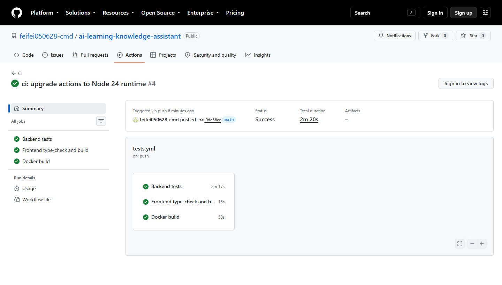

# AI 技术学习知识库与智能问答系统

面向个人学习者、技术团队与内部培训场景的可信 AI 知识工作台。系统将分散的中文技术资料整理为可检索知识库，通过语义检索和大模型生成回答，并同步展示引用文件、文本块与相关度，帮助用户快速找到答案，也能核验答案依据。


## 为什么使用它

通用聊天工具可以快速生成内容，却不一定知道答案来自哪份内部资料。本系统围绕“可验证回答”设计：先从指定知识库检索，再让模型根据召回内容回答；当相关度不足时明确拒答，避免把模型猜测伪装成知识库结论。

- **资料集中管理**：将 Markdown、TXT 和学习笔记整理成统一知识库。
- **中文语义检索**：使用 BGE 向量模型理解问题含义，而不只依赖关键词。
- **回答有据可查**：展示引用文件、文本块编号和相似度，便于回看原始依据。
- **低置信度拒答**：检索结果未达到门槛时返回“现有资料不足”。
- **灵活生成后端**：可使用 Dify Chatflow，也可切换到本地 Qwen。
- **本地数据链路**：文档处理、向量检索和引用管理均在本系统内完成。
- **开箱即用的工作台**：提供响应式 Web 页面、检索详情和知识库状态视图。

## 适用场景

- 个人 AI、Python、PyTorch、Transformer 与 RAG 学习资料问答；
- 团队技术文档、操作手册和培训材料的快速检索；
- 需要展示答案出处的内部知识助手原型；
- RAG 检索、门槛校准和生成质量评估的教学项目。

## 工作方式

```text
技术文档 / 学习笔记
        │
        ▼
清洗与切块 ──► BGE 向量化 ──► 本地知识库
                                   │
用户问题 ──► 语义检索 ──► 相关性门控
                                   │
                       ┌───────────┴───────────┐
                       ▼                       ▼
                  Dify Chatflow            本地 Qwen
                       │                       │
                       └───────────┬───────────┘
                                   ▼
                       回答 + 相关度 + 引用来源
```

Dify 负责答案生成与模型编排，本系统继续负责知识库构建、检索、置信度判断和引用溯源，因此无需把同一套资料重复上传到 Dify。

## 快速体验：Docker 部署

### 1. 准备环境

- Windows、macOS 或 Linux；
- Docker Desktop 或 Docker Engine + Compose；
- 已发布的 Dify Chatbot/Chatflow 应用及应用 API Key。

### 2. 配置服务端环境变量

```powershell
git clone <your-repository-url>
cd "python-learning"
Copy-Item .env.example .env
```

编辑 `.env`：

```dotenv
GENERATION_PROVIDER=dify
DIFY_API_BASE_URL=https://api.dify.ai/v1
DIFY_API_KEY=app-your-real-key
DIFY_USER=ai-learning-assistant
DIFY_TIMEOUT_SECONDS=60
DIFY_VERIFY_SSL=true
```

> API Key 只由 FastAPI 服务端读取。`.env` 已加入 Git 忽略规则，请勿把真实密钥写入前端、截图或提交记录。

### 3. 构建并启动

```powershell
docker compose up --build -d
docker compose ps
```

首次启动会下载 BGE 检索模型，时间取决于网络速度。模型缓存保存在 Docker 命名卷中；源文档与向量知识库以目录挂载方式保存在项目中，重建容器不会丢失上传资料。

### 4. 打开系统

- AI 问答工作台：`http://127.0.0.1:8001/chat`
- 健康检查：`http://127.0.0.1:8001/health`
- OpenAPI 文档：`http://127.0.0.1:8001/docs`

Compose 使用宿主机 `8001` 映射容器内 `8000`，避免与常见本地开发服务冲突。

### 5. 常用运维命令

```powershell
docker compose ps
docker compose logs -f ai-knowledge-assistant
docker compose restart
docker compose down
```

## Dify 应用配置建议

推荐使用精简 Chatflow：

```text
开始 → LLM → 直接回复
```

在 LLM 节点中将 `sys.query` 作为用户消息。系统发送给 Dify 的查询已经包含检索资料、用户问题和回答要求，因此 Dify 侧不必再次添加知识检索节点。

推荐系统提示词：

```text
你是 AI 技术学习知识库问答助手。
用户输入中已经包含由本地知识库检索得到的参考资料和用户问题。
请严格根据参考资料回答，不要编造资料中不存在的信息。
使用清晰、准确的中文，不要输出思考过程；资料不足时回答“现有资料不足”。
```

## 本地运行

不使用 Docker 时，可在 Python 3.10–3.12 环境运行：

```powershell
python -m venv .venv
.\.venv\Scripts\Activate.ps1
python -m pip install --upgrade pip
python -m pip install -r .\rag_project\requirements-dev.txt
python -m uvicorn rag_project.api:app --host 127.0.0.1 --port 8000
```

PowerShell 不会自动载入 `.env`。使用 Dify 时需先把配置写入当前终端环境变量，或直接使用 Docker Compose。需要恢复本地生成时设置 `GENERATION_PROVIDER=local`；本地模式会额外下载并加载 `Qwen/Qwen2.5-0.5B-Instruct`。

## 知识库更新

项目启动时会检查源文档和 Day 1–29 学习笔记是否变化：内容未变化时复用现有向量文件，内容变化时重新导入、切块并构建向量知识库。

```powershell
python -m rag_project.note_importer
python -m rag_project.knowledge_base_builder
```

## 质量保障

项目包含模式校验、文档处理、知识库构建、检索、阈值校准、生成评估、API 生命周期、Dify 客户端及自动更新测试。

```powershell
python -m pytest .\rag_project\tests -q
python -m rag_project.evaluate_retrieval
python -m rag_project.calibrate_threshold
python -m rag_project.evaluate_generation
```

当前离线测试基线：**74 项通过**。

### GitHub Actions

仓库的 `CI` 工作流会在推送到 `main`、创建 Pull Request 或手动触发时并行执行：

- Python 3.11 后端测试；
- Vue TypeScript 类型检查与生产构建；
- Docker 生产镜像构建校验。

工作流只验证代码，不会调用 Dify、读取本地 `.env`、发布镜像或部署服务，因此不需要在 GitHub 中配置模型密钥。可在仓库的 **Actions → CI → Run workflow** 手动运行。



## 技术栈

| 层级 | 技术 |
| --- | --- |
| Web 前端 | Vue 3、TypeScript、Vite |
| API 服务 | FastAPI、Pydantic、Uvicorn |
| 语义检索 | PyTorch、Transformers、BGE-small-zh-v1.5 |
| 答案生成 | Dify Chat/Chatflow 或本地 Qwen |
| 数据与评估 | JSON、PyTorch Tensor、pytest |
| 部署 | Docker、Docker Compose |

## 项目结构

```text
.
├── Dockerfile                    # CPU 版容器镜像
├── compose.yaml                  # 服务、端口和模型缓存卷
├── .env.example                  # 安全配置模板
├── rag_project/
│   ├── api.py                    # FastAPI 入口
│   ├── rag_pipeline.py           # 检索、门控、生成与引用主流程
│   ├── dify_client.py            # Dify 服务端 API 适配层
│   ├── retrieval.py              # 中文语义检索
│   ├── document_processor.py     # 文档清洗与切块
│   ├── document_service.py       # 文档上传、删除与重解析
│   ├── knowledge_base_builder.py # 向量知识库构建
│   ├── frontend/                 # Vue 3 前端源码
│   ├── web/                      # 前端生产构建产物
│   └── tests/                    # 自动化测试
└── day01笔记.txt–day29笔记.txt    # 示例学习知识源
```

更详细的模块说明见 [`rag_project/README.md`](rag_project/README.md)。

## 安全与隐私

- Dify API Key 只保存在服务端环境变量中；
- `.env`、虚拟环境、模型权重和本地缓存不会提交到 Git；
- 前端不保存或发送模型密钥；
- Dify 模式下，召回的相关文本片段会发送至所配置的 Dify 服务用于生成答案；如资料具有保密要求，请使用受控的自部署 Dify 与模型服务。

## 当前边界

- 当前定位为单用户本地知识工作台，尚未实现登录、多租户和权限系统；
- 文档列表统一展示 29 篇只读学习笔记与上传资料；上传资料支持删除和重新解析，并会同步更新向量索引；
- 会话历史、回答反馈和流式生成尚无持久化后端，相关前端区域属于明确标注的演示功能；
- 生成结果仍应结合引用原文人工核验；
- 示例评估集规模有限，评估指标用于项目迭代，不代表生产 SLA。

## API 示例

```bash
curl -X POST "http://127.0.0.1:8001/ask" \
  -H "Content-Type: application/json" \
  -d '{"query":"RAG由哪三个阶段组成？","top_k":3,"min_similarity":0.48}'
```

成功响应包含 `answer`、`passed`、`max_score` 和 `sources`，分别代表回答、门槛结果、最高相似度和引用来源。

---

本项目适合用作个人知识助手、内部知识库原型，以及中文 RAG 全流程学习与验证项目。
